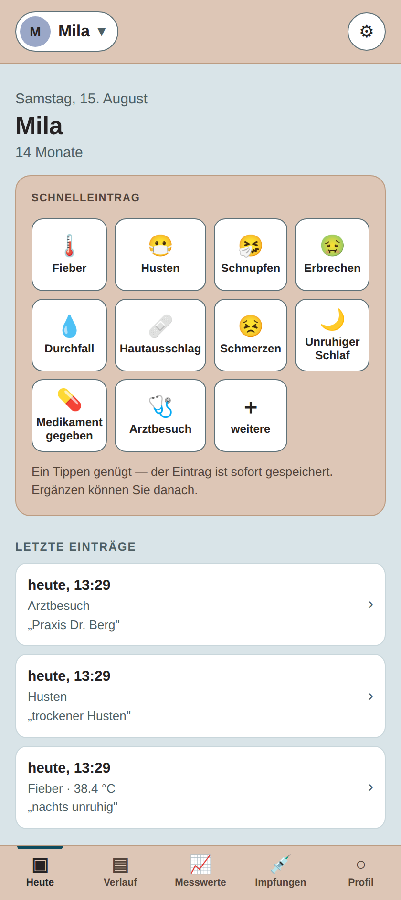
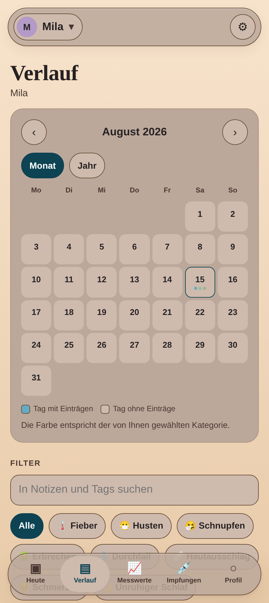
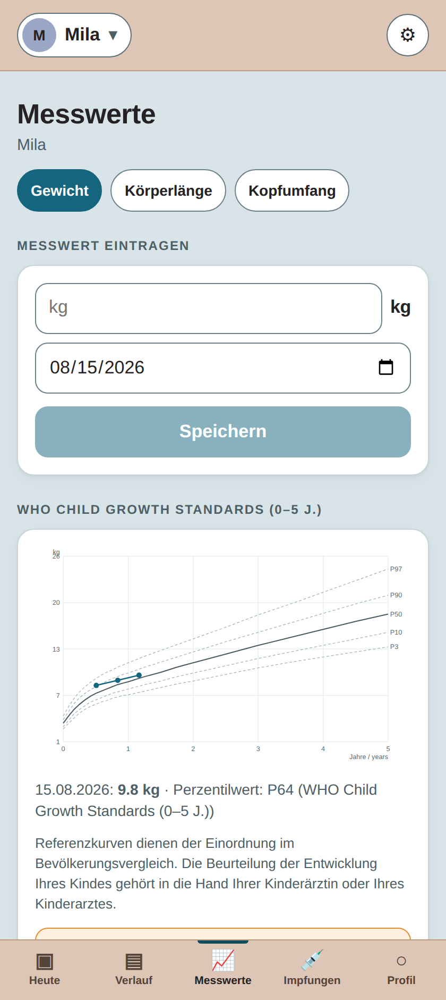
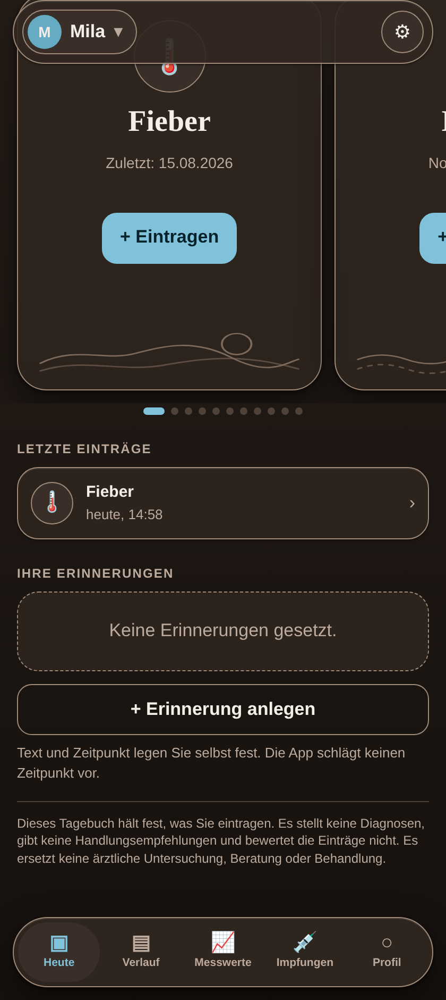

# Kinder-Gesundheitstagebuch

Ein privates, elternseitig geführtes Tagebuch zur Dokumentation von Beobachtungen,
Messwerten und Ereignissen rund um die Gesundheit des eigenen Kindes.

> **Die Anwendung erfasst, speichert, stellt dar und exportiert das, was Eltern
> selbst eintragen. Sie bewertet nichts, empfiehlt nichts, prognostiziert nichts
> und leitet nichts ab.**
>
> Verbindlich für jede Änderung: **[`REGULATORY.md`](REGULATORY.md)**

| Heute | Verlauf | Messwerte | Dunkel |
|---|---|---|---|
|  |  |  |  |

```bash
cd app && npm install && npm run dev
```

## Inhalt

| Was | Wo |
|---|---|
| **Abgrenzungsdokumentation** — Zweckbestimmung, Ausschlussliste, Begründung | [`REGULATORY.md`](REGULATORY.md) |
| Anwendung (React + TypeScript, local-first) | [`app/`](app/) · [README](app/README.md) |
| Store-Texte Deutsch | [`store/store-listing-de.md`](store/store-listing-de.md) |
| Store-Texte Englisch | [`store/store-listing-en.md`](store/store-listing-en.md) |
| Datenschutzerklärung (Entwurf) | [`docs/DATENSCHUTZ.md`](docs/DATENSCHUTZ.md) |
| Marktanalyse (früherer Stand) | [`docs/MARKTANALYSE.md`](docs/MARKTANALYSE.md) |
| PRD (früherer Stand, in Teilen überholt) | [`docs/PRD.md`](docs/PRD.md) |

## Funktionsumfang

**Tagebuch.** Schnelleintragskacheln für Fieber, Husten, Schnupfen, Erbrechen,
Durchfall, Hautausschlag, Schmerzen, unruhigen Schlaf, Medikamentengabe und
Arztbesuch — umbenennbar, ergänzbar, ausblendbar. Ein Tippen legt den Eintrag mit
Zeitstempel an; Notiz, gemessene Temperatur, Foto und Tags sind freiwillige
Ergänzung.

**Medikamentenprotokoll.** Präparat und Menge als freier Text mit Zeitstempel.
Keine Wirkstoffdatenbank, keine Berechnung, kein Intervall.

**Erinnerungen.** Text und Zeitpunkt legt der Nutzer fest.

**Kalender.** Monats- und Jahresansicht, Tage mit Einträgen tragen Punkte in der
Farbe der selbst gewählten Kategorie. Suche und Filter über Zeitraum, Kategorie,
Tag und Freitext.

**Diagramme.** Balken mit der Anzahl der eigenen Einträge je Tag beziehungsweise
je Monat, Punkte mit der eingetragenen Temperatur über der Zeit — beide mit x-
und y-Achse. Ohne Trendlinie, ohne Schwellenwerte, ohne Einfärbung nach Höhe des
Werts.

**Messwerte.** Gewicht, Körperlänge, Kopfumfang auf einer wählbaren Referenzkurve,
mit beschrifteten Linien (P3/P10/P50/P90/P97) und neutralem Perzentilwert.

**Impfübersicht.** Manuell geführte Liste plus Fotos des Impfpasses. Keine
Fälligkeiten, keine Vollständigkeitsprüfung, kein Abgleich mit einem Impfplan.

**Zusammenzählung.** Je Kategorie und Zeitraum: Anzahl der Einträge, Kalendertage
mit einem Eintrag, längste Folge aufeinanderfolgender solcher Tage, erster und
letzter Eintrag. Keine Zusammenfassung zu Episoden, keine Schwellenwerte.

**Ein Kind zu zweit führen.** Jedes Kind bekommt auf Wunsch einen
alphanumerischen Code. Damit erzeugt die App ein verschlüsseltes Übergabepaket,
das die zweite Person einliest — danach führen beide Geräte dasselbe Kind.
Erneutes Einlesen führt zusammen statt zu verdoppeln; gelöschte Einträge bleiben
gelöscht. Ohne Server: Den Übertragungsweg wählt der Nutzer selbst, und es ist
ein Abgleich zu einem Zeitpunkt, keine laufende Synchronisierung.

**Export.** PDF mit Rohdatentabellen und der Kopfzeile „Elterngeführte
Dokumentation. Keine ärztliche Bewertung." Dazu JSON und CSV.

**Technik.** Local-first, kein Konto, kein Server, keine Werbung, keine
Tracking-Bausteine. Offline vollständig nutzbar. Deutsch und Englisch. Auf Wunsch
App-Sperre mit Passwort und AES-GCM-Verschlüsselung auf dem Gerät.

## Was bewusst fehlt

Kein berechneter Gesundheitswert. Keine Trendbewertung. Keine Mustererkennung.
Keine Zusammenfassung von Einträgen zu Krankheitsepisoden oder „Schüben".
Keine Einstufung von Messwerten. Keine Schwellenwertwarnung. Keine
Dosierungslogik. Keine Impfplan-Ableitung. Kein Symptom-Checker. Keine
Entwicklungsbewertung. Keine KI.

Vollständige Liste mit Begründung: [`REGULATORY.md`](REGULATORY.md) Abschnitt 3.

**Prüffrage vor jedem neuen Feature:** Erzeugt die Anwendung eine Aussage, die
nicht bereits vom Nutzer eingegeben wurde? Wenn ja — nicht bauen.

## Qualitätssicherung

```bash
cd app
npm run check:wording   # Wortliste maschinell durchgesetzt, DE und EN
npm run build           # Typprüfung und Produktions-Build
npm run lint
```

Die Wortlisten-Prüfung bricht mit Exit-Code 1 ab, sobald ein verbotener Begriff in
einem Oberflächen- oder Store-Text auftaucht. Sie gehört in die CI.

## Veröffentlichen

Ein Push auf den Entwicklungszweig baut, prüft und veröffentlicht die Anwendung
über [`.github/workflows/netlify.yml`](.github/workflows/netlify.yml). Die
Prüfungen laufen vor dem Upload — ein Kontrastverstoß oder ein verbotener
Begriff aus der Wortliste geht nicht online.

Einmalig einzurichten ist ein Netlify-Zugriffstoken als Repository-Secret
`NETLIFY_AUTH_TOKEN`. Fehlt es, laufen Prüfungen und Build trotzdem; der Upload
wird übersprungen und im Protokoll als Warnung vermerkt.

## Vor Marktbereitstellung zu klären

1. **Juristische Prüfung der Abgrenzung** durch eine auf MDR spezialisierte
   Kanzlei, mit Bezug auf MDCG 2019-11 Rev. 1 — blockierend
2. **Lizenz Kromeyer-Hauschild (2001)** — bis dahin im Code gesperrt und nicht
   auswählbar
3. **KiGGS-Nutzungsbedingungen** beim RKI erfragen
4. **Amtliche LMS-Parameter** für WHO und CDC einsetzen; die aktuell hinterlegten
   Kurvenwerte sind ungeprüfte Näherungen und in der Oberfläche so gekennzeichnet
5. **Datenschutz-Folgenabschätzung** nach Art. 35 DSGVO

Details und Verantwortlichkeiten: [`REGULATORY.md`](REGULATORY.md) Abschnitt 7.

---

*Die Anwendung trifft keine medizinischen Aussagen, stellt keine Diagnosen, gibt
keine Handlungsempfehlungen und bewertet die eingegebenen Daten nicht. Sie ersetzt
keine ärztliche Untersuchung, Beratung oder Behandlung.*
