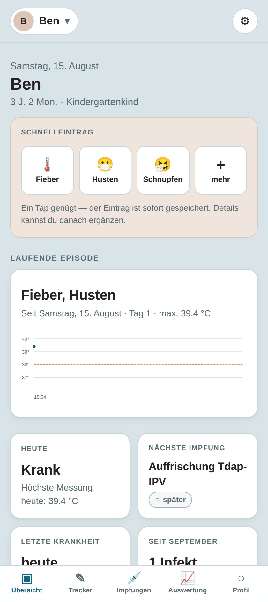
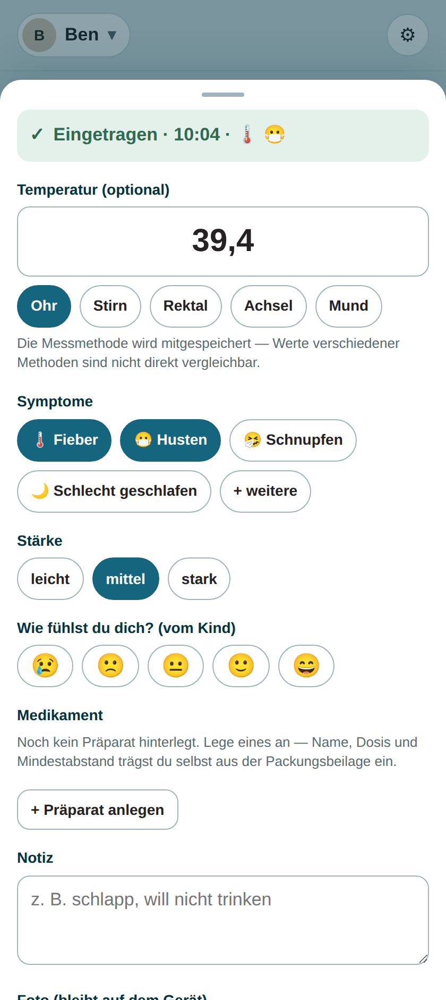
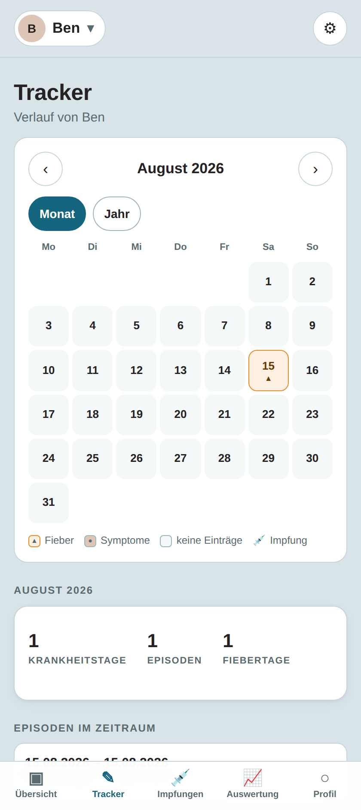
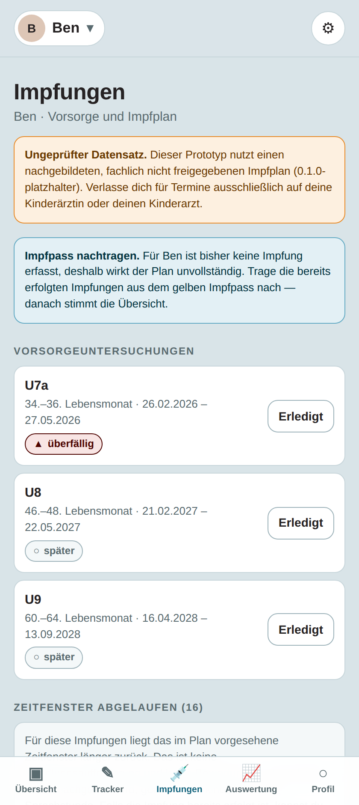

# family-health-mirror

**KinderGesundheit+** — Konzept und lauffähiger Prototyp einer App, mit der Eltern
Krankheiten, Impfungen und Entwicklung ihres Kindes von der Geburt bis ins Grundschulalter
dokumentieren.

## Inhalt

| Was | Wo |
|---|---|
| Product Requirement Document | [`docs/PRD.md`](docs/PRD.md) |
| Wettbewerbsanalyse und Differenzierung | [`docs/MARKTANALYSE.md`](docs/MARKTANALYSE.md) |
| Lauffähiger Prototyp (React-PWA) | [`app/`](app/) — [README](app/README.md) |

```bash
cd app && npm install && npm run dev
```

| Dashboard | Schnelleingabe | Tracker | Impfungen |
|---|---|---|---|
|  |  |  |  |

## Kurzfassung

* **Zielgruppe:** Eltern in Deutschland mit Kindern von 0 bis 10 Jahren
* **Kernidee:** altersadaptives Tracking + STIKO-/U-Untersuchungs-Manager + verständliche
  Auswertungen + Arzt-Export — in *einem* Produkt statt in vier
* **Architekturprinzip:** local-first, kein Konto, keine Werbung, keine Tracking-SDKs
* **Bewusst ausgeschlossen:** Diagnose, Triage, Dosierungsrechner — die App dokumentiert und
  stellt dar, sie bewertet nicht

## Die Marktlücke in einem Satz

Der Markt zerfällt in vier Segmente — Baby-Tracker (enden nach dem ersten Jahr),
Impfpass-Apps (nur Impfungen), Krankheits-Spezialisten wie FeverApp (nur Fieber) und
Kassen-Apps (kassengebunden). Eine Familie mit zwei Kindern nutzt heute drei bis vier davon
parallel plus Papier. Details in der [Marktanalyse](docs/MARKTANALYSE.md).

## Was die App wesentlich besser macht

1. **Durchgehende Historie.** Der Vorjahresvergleich („5 Infekte seit Kita-Start, im
   Vorjahreszeitraum 2") setzt 24+ Monate Daten in einem Produkt voraus — ein Zeitgraben, den
   Wettbewerber nicht per Feature-Update schließen können.
2. **Speichern zuerst.** Der Tap auf den Chip *ist* der Eintrag. Wer das Formular wegwischt,
   verliert nichts — das eliminiert die häufigste Ursache für Datenlücken.
3. **Der Arzt-Export als Produkt.** Eine Seite, in 15 Sekunden erfassbar, optimiert für
   jemanden, der die App nie installieren wird — und zugleich der stärkste
   Weiterempfehlungskanal.
4. **Vertrauensarchitektur.** Kein Konto, keine E-Mail, keine Werbe-SDKs, kostenloser
   Vollexport.

## Vor der Umsetzung zu klären

1. MDR-Einstufung (Medizinprodukt ja/nein) durch eine spezialisierte Kanzlei — blockierend
2. Kontrastwerte des Farbsystems messen und die Handlungsfarbe festlegen — blockierend fürs Design
3. Versionierten STIKO-Datensatz aufbauen und die jährliche Pflege verantwortlich zuweisen
4. Datenschutz-Folgenabschätzung ansetzen

Details in [§7 des PRD](docs/PRD.md#7-nächste-schritte).

> **Hinweis zum Prototyp:** Impfplan-, Vorsorge- und Wachstumsdaten sind ungeprüfte
> Platzhalter und in der App als solche gekennzeichnet. Die lokale Datenbank ist noch nicht
> verschlüsselt.

---

*Konzeptdokumentation und Prototyp. Kein Medizinprodukt, keine medizinische Beratung.*
